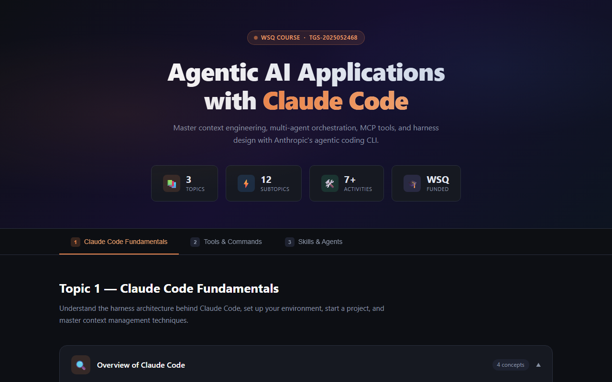

[](https://christinecheong.github.io/AAwithCC/)
[](https://github.com/christinecheong/AAwithCC)
[](https://github.com/christinecheong/AAwithCC)
[](https://github.com/christinecheong/AAwithCC)

# Agentic AI Applications with Claude Code

A **zero-dependency interactive reference** for building agentic AI applications — covering context engineering, multi-agent orchestration, MCP tools, and harness design with Anthropic's agentic coding CLI. Runs entirely in the browser with no build step, no package manager, no framework.

🌐 **Live demo (Reference page):** https://christinecheong.github.io/AAwithCC/

🏡 **Live demo (Luxe Interiors):** https://christinecheong.github.io/AAwithCC/luxe-interiors.html

---

## Preview



---

## What's Inside

The reference page organises **3 topics and 12 subtopics** into a sticky tab navigation with single-open accordions per panel.

### Topic 1 — Claude Code Fundamentals
- **Overview of Claude Code** — Harness architecture, how Claude Code reads and executes tasks
- **Setup Claude Code** — Installation, authentication, IDE integration, first-run checklist
- **Start a Project** — CLAUDE.md conventions, project structure, prompting strategies
- **Adding Context** — Memory files, `#`-file mentions, web fetch, paste workflows
- **Controlling Context** — Compaction, `/clear`, context budgets, token-efficient patterns

### Topic 2 — Tools & Commands
- **Create Custom Commands** — Authoring `.claude/commands/*.md` slash-command prompt files
- **Tools & MCP** — Built-in tools, MCP server configuration, tool approval modes, parallel calls

### Topic 3 — Skills & Agents
- **Skills** — Packaging reusable agent behaviours as invocable skill files
- **Multiple Agents & Sub-Agents** — Orchestration patterns, spawning sub-agents, cost/latency trade-offs
- **Claude GitHub Actions** — CI/CD integration using Claude's official GitHub Action
- **Hooks** — Pre/post-tool-call hooks for automated safety checks and side-effects

---

## Architecture

```
index.html  (entirely self-contained — no external imports)
├─ <head>
│   └─ <style>           All CSS — dark theme, CSS custom properties on :root
│                        Key variables: --bg, --surface, --orange, --blue, --green, --purple
├─ <body>
│   ├─ .hero             Gradient banner · stat cards (3 Topics · 12 Subtopics · 7+ Activities · WSQ Funded)
│   ├─ .tabs-wrapper     Sticky tab nav · data-tab routing · keyboard accessible (Arrow Left/Right)
│   ├─ .content-area
│   │   ├─ #t1           Claude Code Fundamentals (5 accordions)
│   │   ├─ #t2           Tools & Commands (2 accordions)
│   │   └─ #t3           Skills & Agents (4 accordions)
│   │       └─ .subtopic × N   Single-open accordion per panel via toggle()
│   └─ <script>          Vanilla JS — tab switching · accordion · keyboard nav
└─ (no imports, no bundler, no build pipeline)
```

---

## Quick Start

```bash
# Clone the repo
git clone https://github.com/christinecheong/AAwithCC.git
cd AAwithCC

# Open directly in Chrome (Windows)
& "C:\Program Files\Google\Chrome\Application\chrome.exe" index.html

# Or just double-click index.html — no server required
```

---

## File Layout

| File | Status | Purpose |
|------|--------|---------|
| `index.html` | **Active** | Self-contained reference page — all CSS and JS embedded |
| `.github/workflows/deploy.yml` | **Active** | GitHub Actions → GitHub Pages deployment |
| `CLAUDE.md` | **Active** | Claude Code project instructions |
| `.claude/commands/ship.md` | **Active** | `/ship` custom command — publish safely to GitHub |
| `docs/screenshot.png` | **Active** | README preview screenshot |
| `style.css` | Legacy | CSS for the original Luxe Interiors landing page |
| `script.js` | Legacy | JS for the original Luxe Interiors landing page |
| `luxe-interiors.html` | Legacy | Original Luxe Interiors landing page |

---

## Deployment

Every push to `main` triggers the GitHub Actions workflow in [`.github/workflows/deploy.yml`](.github/workflows/deploy.yml), which deploys the repo root to GitHub Pages using the official `actions/deploy-pages` action.

```yaml
on:
  push:
    branches: [main]
  workflow_dispatch:   # manual trigger available in GitHub UI

jobs:
  deploy:
    environment:
      name: github-pages
      url: ${{ steps.deployment.outputs.page_url }}
    runs-on: ubuntu-latest
    steps:
      - uses: actions/checkout@v4
      - uses: actions/configure-pages@v5
      - uses: actions/upload-pages-artifact@v3
        with:
          path: '.'    # index.html is at the repo root
      - uses: actions/deploy-pages@v4
```

No build step needed — `index.html` is uploaded directly as the Pages artifact. Live within ~60 seconds of a push.

---

## Extending the Page

### Adding a new tab

1. Add `<button class="tab-btn" data-tab="<id>">` inside `.tabs-nav`
2. Add a matching `<div class="tab-panel" id="<id>">` inside `.content-area`
3. No JS changes needed — the tab switcher queries all `.tab-btn` elements dynamically

### Adding a new accordion item

Use the existing `.subtopic` / `.subtopic-header` / `.subtopic-body` structure inside a `.subtopics` container. The `toggle()` function is global and handles any element with this shape — it closes open siblings before opening the clicked one.

> **Known gotcha:** JS string literals that contain apostrophes **must** use double quotes or escaped single quotes — a bare `'We'll...'` will silently break the entire script since there is no bundler to catch it.

---

## License

All Rights Reserved — © Christine Cheong